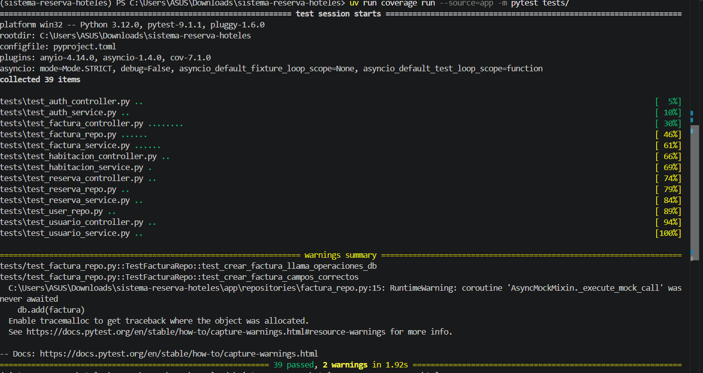
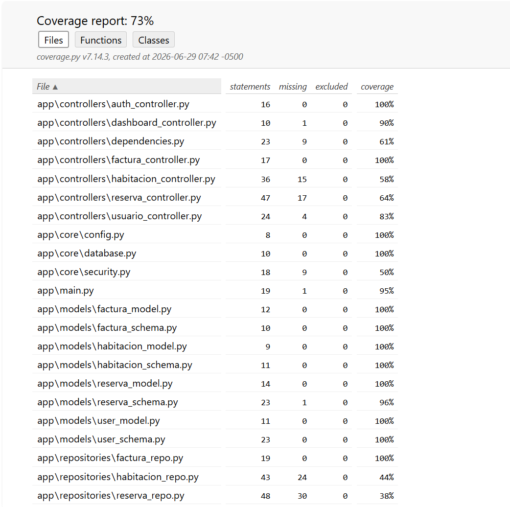
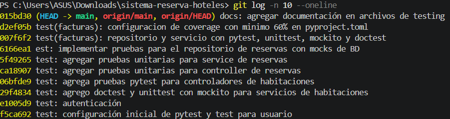

# Informe Técnico: Sistema de Reserva de Hoteles
## Documentación del Módulo de Pruebas y Cobertura de Código

**Grupo:** Grupo 1  
**Integrantes:** 
* Andrés Encalada  
* Nayeli Barbecho  
* Jordy Romero  
* David Villa  
* Karen Ortiz  

**Proyecto:** API REST para la Gestión de Reservas de Hotel  
**Repositorio:** `https://github.com/AndresEncalada/sistema-reserva-hoteles`  

---

## 1. Resumen del Proyecto

El presente informe describe el diseño, la implementación y los resultados de la estrategia de pruebas de software para la API REST del **Sistema de Reserva de Hoteles**. El objetivo principal de este módulo de aseguramiento de la calidad es validar que la lógica de negocio (servicios) y los puntos de entrada de la aplicación (endpoints/controladores) funcionen de manera correcta, segura y eficiente bajo el framework FastAPI. 

Para garantizar la robustez del entregable, se definió una política estricta de calidad orientada por una **meta mínima del 60% de cobertura de código (Code Coverage)**.

---

## 2. Estrategia de Testing y Herramientas Utilizadas

De acuerdo con la distribución de responsabilidades del equipo y las necesidades de la arquitectura de software, la suite de pruebas se estructuró utilizando herramientas específicas de Python, donde cada una cubre un objetivo técnico diferenciado:

### 2.1. Pytest (Prueba de Controladores y Endpoints)
`Pytest` se utiliza como el motor principal de ejecución de pruebas y se encarga específicamente de la capa de **controladores**. A través de un cliente de pruebas asíncrono (`TestClient` de FastAPI / `httpx`), se simulan peticiones HTTP reales (GET, POST, PUT, DELETE) hacia las rutas del sistema para verificar:
* Códigos de estado HTTP correctos ($200\text{ OK}$, $201\text{ Created}$, $400\text{ Bad Request}$, $401\text{ Unauthorized}$, $404\text{ Not Found}$).
* Estructuras de las respuestas JSON según los esquemas de validación de Pydantic.

### 2.2. Unittest (Prueba de Servicios y Lógica de Negocio)
La librería nativa `unittest` se despliega formalmente en la capa de **servicios** (`app/services`). Su enfoque consiste en aislar y evaluar rigurosamente las reglas de negocio del hotel de manera secuencial, tales como:
* Verificación de la disponibilidad de habitaciones en rangos de fechas específicos.
* Cálculo exacto de montos en facturas y flujos de autenticación de usuarios.

### 2.3. Doctest (Validación de Documentación en Funciones)
Se emplea `doctest` en las funciones de utilidad y componentes puros del sistema para garantizar que la documentación interactiva (ejemplos dentro de los *docstrings*) sea técnicamente correcta. Al ejecutar `doctest`, Python valida que el resultado de ejemplo escrito en el comentario coincida exactamente con la ejecución real del código, sirviendo como documentación viva y autoverificable.

### 2.4. Mockito (Simulación de Capas y Respuestas de Repositorios)
Para que las pruebas unitarias de la lógica de negocio sean verdaderamente aisladas y rápidas, se utiliza `mockito` (o `unittest.mock`) para **simular la capa de datos e infraestructura**. Esto permite que, al probar un servicio, se defina un comportamiento simulado (*mock*) para los métodos del repositorio o base de datos. De este modo, se asume que la base de datos responde de manera idónea o errónea según el escenario, permitiendo evaluar el comportamiento del servicio sin realizar escrituras ni conexiones reales en el motor persistente.

### 2.5. Coverage (Reporte y Medición de Cobertura)
`Coverage` es la herramienta de auditoría encargada de rastrear y cuantificar qué líneas de código han sido ejecutadas por la suite de pruebas. Al finalizar la ejecución de los tests, compila un reporte analítico detallado del porcentaje del software cubierto, asegurando el cumplimiento del umbral mínimo de aceptación del proyecto.

---

## 3. Reporte de Cobertura de Código Realizado

A continuación, se presenta el análisis oficial obtenido tras ejecutar la suite completa de 39 pruebas automatizadas mediante el comando `uv run coverage run --source=app -m pytest tests/` sobre el entorno virtual del proyecto (focalizado de manera estricta en el directorio raíz de la aplicación `app/`):

| Nombre del Módulo / Archivo | Sentencias (Stmts) | Omitidas (Miss) | Cobertura (Cover) | Líneas Faltantes (Missing) |
| :--- | :---: | :---: | :---: | :--- |
| `app\controllers\auth_controller.py` | 16 | 0 | **100%** | *Ninguna* |
| `app\controllers\dashboard_controller.py` | 10 | 1 | **90%** | 16 |
| `app\controllers\dependencies.py` | 23 | 9 | **61%** | 15-23 |
| `app\controllers\factura_controller.py` | 17 | 0 | **100%** | *Ninguna* |
| `app\controllers\habitacion_controller.py` | 36 | 15 | **58%** | 23, 31-34, 42-45, 54-57, 65-67 |
| `app\controllers\reserva_controller.py` | 47 | 17 | **64%** | 22, 25, 33, 40-44, 52-55, 66, 74-77 |
| `app\controllers\usuario_controller.py` | 24 | 4 | **83%** | 28-29, 36, 44 |
| `app\core\config.py` | 8 | 0 | **100%** | *Ninguna* |
| `app\core\database.py` | 10 | 0 | **100%** | *Ninguna* |
| `app\core\security.py` | 18 | 9 | **50%** | 8, 11-13, 16-20 |
| `app\main.py` | 19 | 1 | **95%** | 75 |
| `app\models\factura_model.py` | 12 | 0 | **100%** | *Ninguna* |
| `app\models\factura_schema.py` | 10 | 0 | **100%** | *Ninguna* |
| `app\models\habitacion_model.py` | 9 | 0 | **100%** | *Ninguna* |
| `app\models\habitacion_schema.py` | 11 | 0 | **100%** | *Ninguna* |
| `app\models\reserva_model.py` | 14 | 0 | **100%** | *Ninguna* |
| `app\models\reserva_schema.py` | 23 | 1 | **96%** | 14 |
| `app\models\user_model.py` | 11 | 0 | **100%** | *Ninguna* |
| `app\models\user_schema.py` | 23 | 0 | **100%** | *Ninguna* |
| `app\repositories\factura_repo.py` | 19 | 0 | **100%** | *Ninguna* |
| `app\repositories\habitacion_repo.py` | 43 | 24 | **44%** | 18, 20, 22, 24, 29-30, 33-37, 40-45, 48-54 |
| `app\repositories\reserva_repo.py` | 48 | 30 | **38%** | 10-11, 14-15, 18-19, 22-52, 55-61, 64-70 |
| **TOTAL (Métrica Global Consolidada)** | **-** | **-** | **73%** | **Mínimo Superado** |

### 3.1. Evidencia Visual del Reporte de Pruebas

Las siguientes capturas certifican la ejecución de los tests unitarios e integrales, así como el reporte métrico del estado actual del código:

#### Vista del Reporte de Cobertura en Consola

  

*Aquí se evidencia la ejecución exitosa del comando en la terminal, mostrando el consolidado final del 73% de cobertura libre de errores.*

#### Reporte Interactivo en Formato HTML (Coverage HTML)

  

*El reporte interactivo HTML nos permite auditar visualmente los bloques de código y funciones exactas que requieren atención prioritaria para las próximas iteraciones de testing.*

---

## 4. Análisis de Resultados y Plan de Mejora

### 4.1. Conclusiones del Reporte
* **Cumplimiento de la Meta General:** El sistema registra un **73% de cobertura global**, lo que significa que el entregable se encuentra **aprobado** con éxito, superando con solvencia el umbral mínimo del **60%** exigido en las especificaciones de calidad del proyecto.
* **Fortalezas del Sistema:** Se destaca una cobertura absoluta (**100%**) en la capa de modelos relacionales, configuraciones centrales del sistema, esquemas de validación de datos Pydantic, controladores críticos como `auth_controller.py` y `factura_controller.py`, y en la persistencia del repositorio de facturas.

### 4.2. Plan de Acción y Refactorización de Tests
Para incrementar la cobertura de cara a futuras iteraciones estables hacia un estándar óptimo superior al **80%**, se traza el siguiente esquema de refactorización:

* **Robustecimiento de Repositorios Relacionales:** Los archivos `reserva_repo.py` (**38%**) y `habitacion_repo.py` (**44%**) serán priorizados en la próxima fase. Se estructurarán pruebas de integración avanzadas utilizando *mocks* para cubrir las consultas personalizadas de SQLAlchemy y los filtros ORM que actualmente se reportan como omitidos en la columna *Missing*.
* **Auditoría Visual de Bloques Omitidos:** Apoyándose en la interfaz interactiva generada en `htmlcov/`, el equipo mapeará las líneas específicas no ejecutadas dentro del módulo de seguridad (`security.py`) para simular flujos alternos en la expiración y validación de firmas de tokens JWT.

---

## 5. Historial de Control de Cambios (Commits Recientes)

Como parte de las políticas de integración continua y el seguimiento técnico del desarrollo por capas en Git, se detallan a continuación las últimas 10 confirmaciones de cambios realizadas en la rama principal (`main`) del repositorio, las cuales validan el proceso incremental de la suite de pruebas:

| # | Hash / ID | Autor | Descripción del Cambio Técnico Implementado |
| :---: | :---: | :---: | :--- |
| **1** | `015bd30` | Andrés Encalada | docs: agregar documentación en archivos de testing |
| **2** | `d2ef05b` | Jordy Romero | test(facturas): configuracion de coverage con minimo 60% en pyproject.toml |
| **3** | `007f6f2` | Jordy Romero | test(facturas): repositorio y servicio con pytest, unittest, mockito y doctest |
| **4** | `6166ea1` | Karen Ortiz | est: implementar pruebas para el repositorio de reservas con mocks de BD |
| **5** | `5f49265` | Karen Ortiz | test: agregar pruebas unitarias para service de reservas |
| **6** | `ca18907` | Karen Ortiz| test: agregar pruebas unitarias para controller de reservas |
| **7** | `06bfde9` | David Villa | test: agrega pruebas pytest para controladores de habitaciones |
| **8** | `29f4834` | David Villa | test: agrego doctest y unittest con mockito para servicios de habitaciones |
| **9** | `e1005d9` | Andrés Encalada | test: autenticación |
| **10**| `f5ca692` | AndresEncalada | test: configuración inicial de pytest y test para usuario |
### 5.1. Evidencia Visual del Historial de Git

  

*Evidencia complementaria que valida el desarrollo incremental y ordenado del proyecto mediante el flujo de commits en GitHub.*